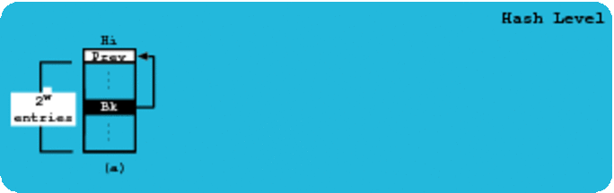

Lock-Free Fixed Persistent And Sorted Hash Map (FFPS)

The article "On Extending a Fixed Size, Persistent and Lock-Free Hash
Map Design to Store Sorted Keys" available in
"http://doi.org/10.1109/ISPA-IUCC-BDCloud-SocialCom-SustainCom.2018.00070"
has more details about the FFPS model.

Steps to compare Concurrent Hash Maps (CHM), Concurrent Skip Lists
(CSL), Concurrent Tries (CT) and FFP (O-Original and S-Sorted) models in
Linux using a terminal emulator:

1. git clone git@github.com:miar/ffps.git

2. cd ffp/benchSuite/

3. Open the Makefile file, update JDK_PATH and JDK with your system
values, close Makefile and do 'make' in the terminal

4. Results with execution times and memory used by each model will
appear in the 'tmp' directory

5. If you want to see how our model is implemented check the 'ffpo' and
'ffps' directories.

Enjoy it.